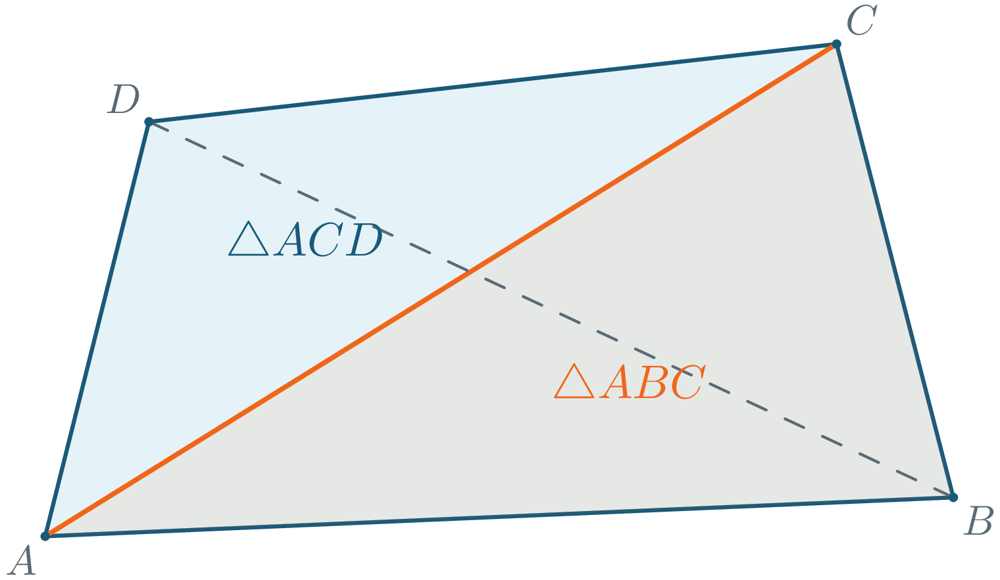
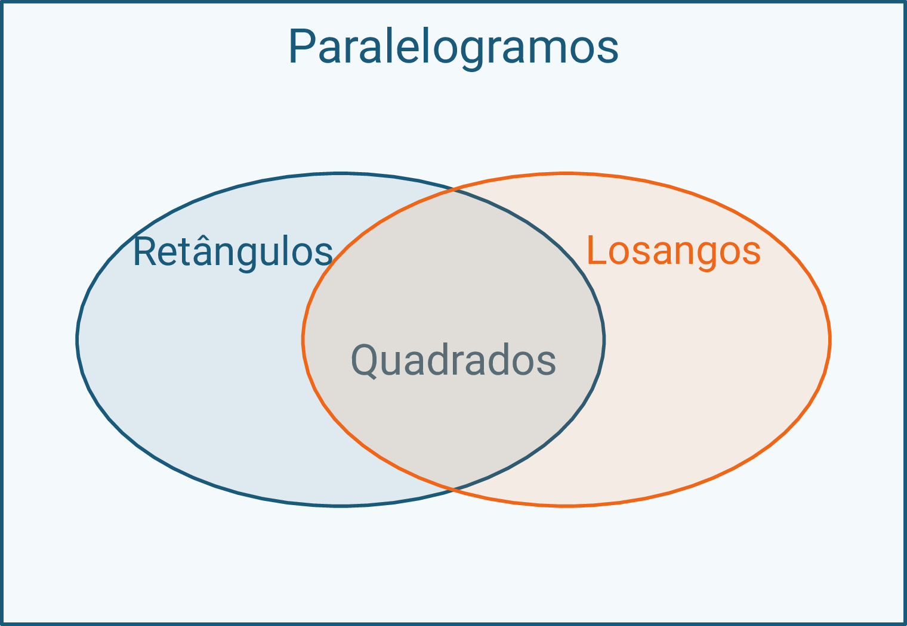
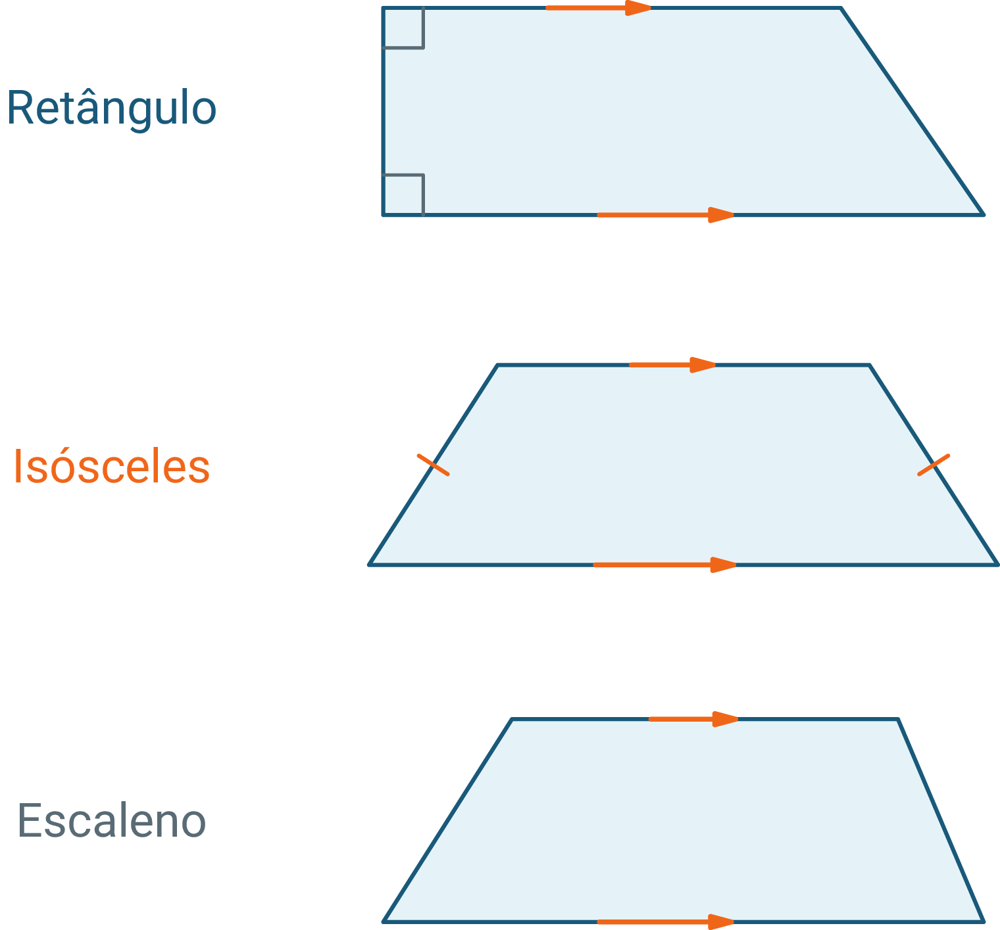
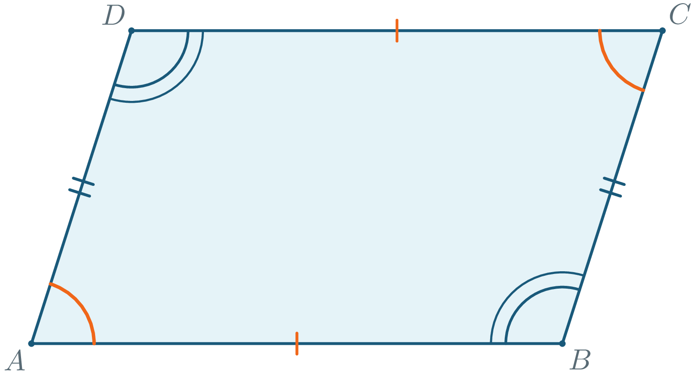
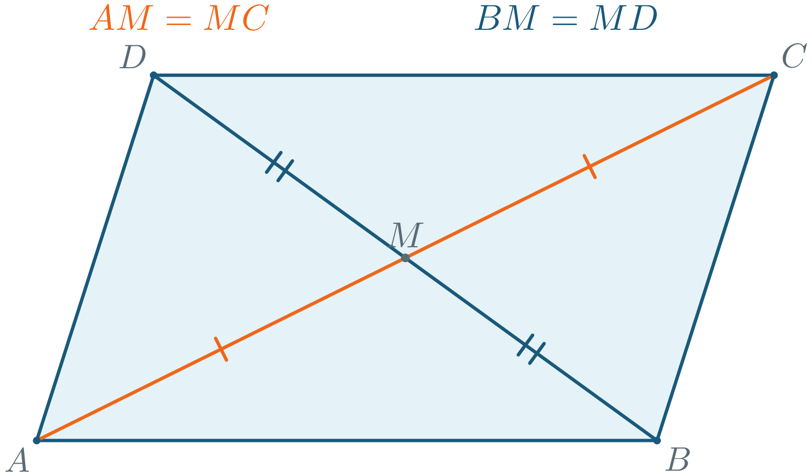
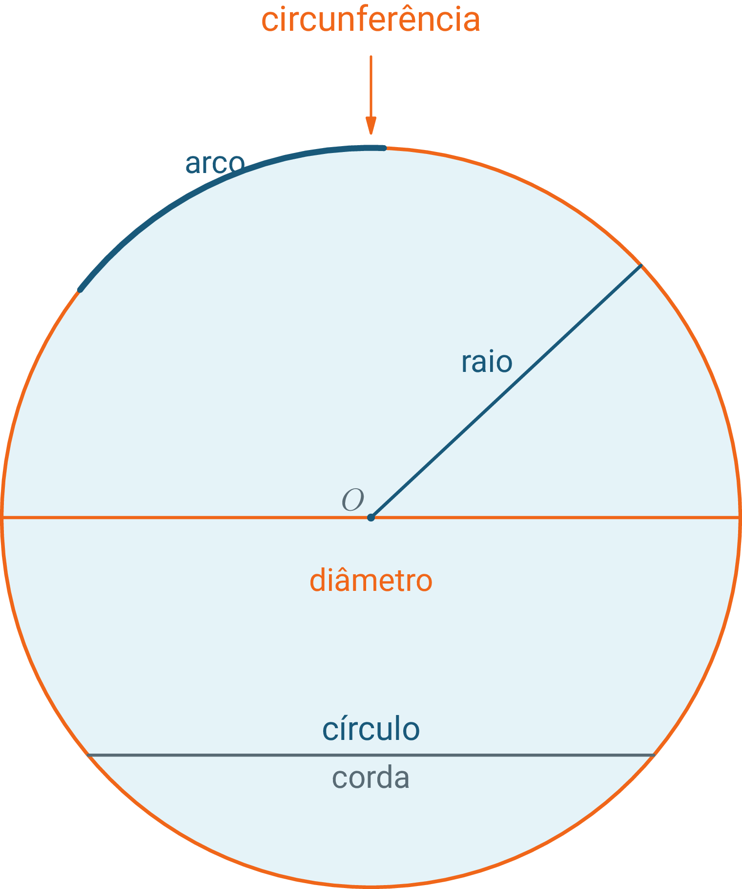
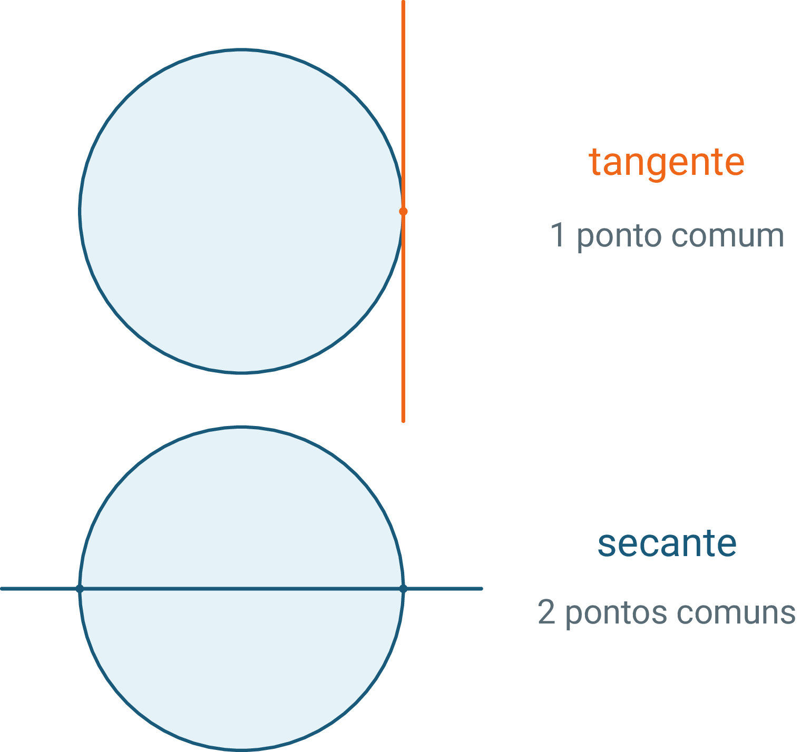
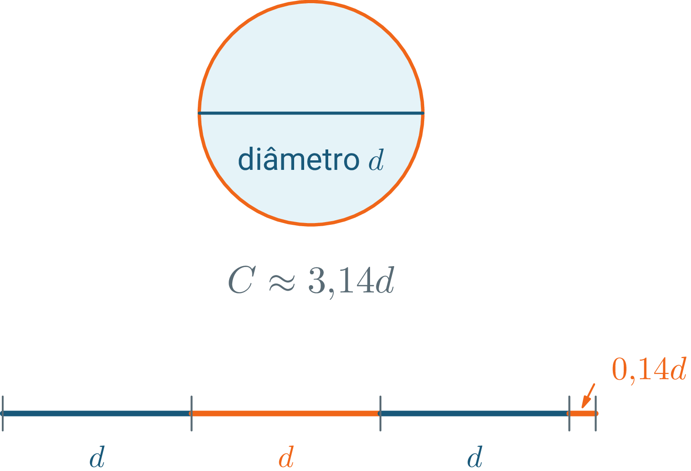

# Geometria — 6º Ano · Bloco 1

> **3º Bimestre — Quadriláteros, circunferência e área** · Bloco 1 (05/08–25/08)

**Capítulos deste bloco**

1. **Quadriláteros e circunferência** (3 aulas)

---

# BL1_Capítulo 1 — Quadriláteros e circunferência

> O quadrado é também um retângulo? Por que o contorno de qualquer objeto redondo mantém a mesma razão com seu diâmetro?

---

## 1. Quadriláteros: conceito e classificação

A bandeira reúne um retângulo verde e um losango amarelo: formas de quatro lados com propriedades distintas.

### 1.1 Elementos, ângulos e famílias

**Quadrilátero** é o polígono de quatro lados. Num quadrilátero $$ABCD$$, identificam-se:

- quatro lados e quatro vértices;
- quatro ângulos internos;
- duas diagonais, $$\overline{AC}$$ e $$\overline{BD}$$, entre vértices não consecutivos.

<!-- figura:inicio fig-01-elementos-e-soma-angular -->

<!-- figura:fim fig-01-elementos-e-soma-angular -->

A diagonal destacada divide o quadrilátero em dois triângulos. Como os ângulos internos de cada triângulo somam $$180^{\circ}$$:

$$180^{\circ}+180^{\circ}=360^{\circ}$$

A quantidade de pares de lados paralelos separa as famílias principais:

| Família | Condição | Casos |
|---|---|---|
| Paralelogramos | dois pares paralelos | retângulo, losango e quadrado |
| Trapézios | exatamente um par paralelo | trapézio retângulo, isósceles e escaleno |

<!-- figura:inicio fig-02-inclusao-dos-paralelogramos -->

<!-- figura:fim fig-02-inclusao-dos-paralelogramos -->

<!-- figura:inicio fig-03-tipos-de-trapezio -->

<!-- figura:fim fig-03-tipos-de-trapezio -->

### 1.2 Inclusão de classes

Retângulo tem quatro ângulos retos; losango, quatro lados congruentes; quadrado reúne as duas propriedades.

**Classificação de uma placa quadrada**

Uma placa tem quatro lados congruentes e quatro ângulos retos. Como ela pode ser classificada?

**Resolução:**

- **Passo 1:** Os ângulos retos atendem à definição de retângulo.
- **Passo 2:** Os lados congruentes atendem à definição de losango.
- **Passo 3:** As duas condições juntas definem o quadrado.

**Resposta:** a placa é quadrado, retângulo, losango e paralelogramo.

**Adrien-Marie Legendre (1752–1833)** sistematizou classificações geométricas usadas no ensino.

> ⚠️ **Atenção:**
>
> Neste material, trapézio tem exatamente um par de lados paralelos e não é paralelogramo.

---

## 2. Propriedades dos paralelogramos

Uma moldura inclinada pode perder os ângulos retos e conservar os dois pares de lados opostos paralelos.

### 2.1 Lados e ângulos

Num paralelogramo $$ABCD$$, lados opostos e ângulos opostos são congruentes. Marcas iguais representam medidas iguais.

<!-- figura:inicio fig-04-lados-e-angulos-opostos -->

<!-- figura:fim fig-04-lados-e-angulos-opostos -->

Uma diagonal divide o paralelogramo em dois triângulos que se encaixam: eles compartilham a diagonal e têm ângulos correspondentes determinados pelos lados paralelos. Por isso:

$$\overline{AB}\cong\overline{CD}$$

$$\overline{BC}\cong\overline{AD}$$

Ângulos consecutivos são suplementares porque ficam entre retas paralelas cortadas por uma transversal:

$$\angle A+\angle B=180^{\circ}$$

### 2.2 Diagonais e medidas

As diagonais encontram-se em $$M$$ e dividem uma à outra em duas partes congruentes.

<!-- figura:inicio fig-05-diagonais-no-ponto-medio -->

<!-- figura:fim fig-05-diagonais-no-ponto-medio -->

**Medidas de uma moldura inclinada**

Dois lados vizinhos medem $$8\,\mathrm{cm}$$ e $$5\,\mathrm{cm}$$, o ângulo $$A$$ mede $$70^{\circ}$$ e $$AM=3\,\mathrm{cm}$$. Determine o perímetro, os demais ângulos e a diagonal $$AC$$.

**Resolução:**

- **Passo 1:** Somar os quatro lados.

$$P=8+5+8+5$$

$$P=26\,\mathrm{cm}$$

- **Passo 2:** Calcular o ângulo consecutivo.

$$\angle B=180^{\circ}-70^{\circ}$$

$$\angle B=110^{\circ}$$

- **Passo 3:** Usar os ângulos opostos congruentes.

$$\angle C=70^{\circ}$$

$$\angle D=110^{\circ}$$

- **Passo 4:** Como $$AM=MC$$, completar a diagonal.

$$AC=AM+MC$$

$$AC=3+3$$

$$AC=6\,\mathrm{cm}$$

**Resposta:** o perímetro mede $$26\,\mathrm{cm}$$, os outros ângulos medem $$110^{\circ}$$, $$70^{\circ}$$ e $$110^{\circ}$$, e a diagonal $$AC$$ mede $$6\,\mathrm{cm}$$.

> 🔢 **Padrão:**
>
> Em todo paralelogramo, ângulos consecutivos somam $$180^{\circ}$$ e as diagonais cortam-se ao meio.

---

## 3. Circunferência e círculo

Uma moeda possui uma borda e uma face inteira; em Geometria, cada uma recebe um nome.

### 3.1 Linha, região e elementos

**Circunferência** é a linha formada pelos pontos à mesma distância de um centro; **círculo** é essa linha com a região interna.

<!-- figura:inicio fig-06-circulo-circunferencia-e-elementos -->

<!-- figura:fim fig-06-circulo-circunferencia-e-elementos -->

Se o centro é $$O$$, os elementos são:

- **raio** — segmento do centro à circunferência;
- **corda** — segmento com extremidades na circunferência;
- **diâmetro** — corda que passa pelo centro;
- **arco** — parte da circunferência.

O diâmetro reúne dois raios alinhados:

$$d=2r$$

Quando uma reta encontra a circunferência, o número de pontos comuns distingue duas posições:

<!-- figura:inicio fig-07-tangente-e-secante -->

<!-- figura:fim fig-07-tangente-e-secante -->

- **tangente** — um ponto comum;
- **secante** — dois pontos comuns.

### 3.2 A razão constante

Ao comparar objetos redondos, o comprimento $$C$$ da circunferência corresponde a pouco mais de três diâmetros.

<!-- figura:inicio fig-08-razao-entre-circunferencia-e-diametro -->

<!-- figura:fim fig-08-razao-entre-circunferencia-e-diametro -->

Essa razão constante é o número $$\pi$$:

$$\frac{C}{d}=\pi\approx3{,}14$$

Como $$d=2r$$, há duas formas equivalentes de calcular o comprimento:

$$C=\pi d$$

$$C=2\pi r$$

**Contorno de uma tampa**

Uma tampa tem diâmetro de $$20\,\mathrm{cm}$$. Calcule o contorno usando $$\pi\approx3{,}14$$.

**Resolução:**

- **Passo 1:** Escolher a fórmula que usa o diâmetro.

$$C=\pi d$$

- **Passo 2:** Substituir os valores.

$$C\approx3{,}14\cdot20$$

$$C\approx62{,}8\,\mathrm{cm}$$

**Resposta:** o contorno da tampa mede aproximadamente $$62{,}8\,\mathrm{cm}$$.

> ⚠️ **Atenção:**
>
> Circunferência é a borda; círculo é a borda junto com toda a região interna.
